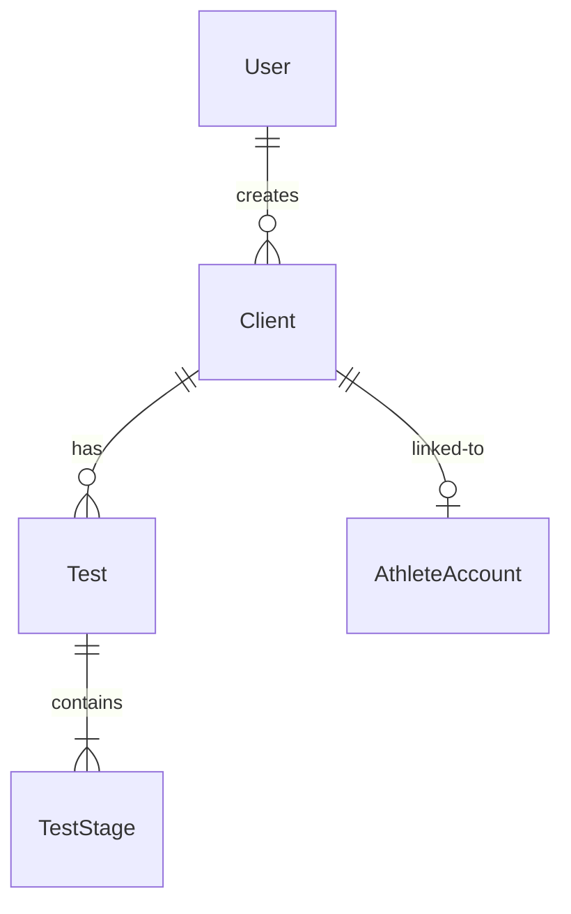

# Long-Term Tasks Evaluation

**Date**: 2025-11-22
**Purpose**: Detailed evaluation of long-term improvement tasks from code review
**Status**: Planning phase

---

## 📊 Task 1: Add ER Diagram for Database

### What It Is

**ER Diagram** = Entity-Relationship Diagram

A visual representation of your database schema showing:
- All 40+ database models (tables)
- Relationships between models (one-to-many, one-to-one, many-to-many)
- Foreign key constraints
- Cascade delete rules
- Field types and constraints

### Why It's Valuable

**Current Problem**:
- 40+ models documented in `prisma/schema.prisma` (2000+ lines of code)
- Relationships described in text format
- No visual overview of system architecture
- New developers need to mentally map relationships

**Benefits**:
1. **Instant Understanding** - See entire data model at a glance
2. **Onboarding** - New developers understand architecture in minutes vs hours
3. **Planning** - Easier to plan new features when you see connections
4. **Documentation** - Visual docs are easier to reference than code
5. **Debugging** - Quickly identify cascade effects and relationship issues
6. **Communication** - Show stakeholders/clients how data flows

### Example of What It Shows

```
┌─────────────┐         ┌─────────────┐         ┌─────────────┐
│    User     │         │   Client    │         │    Test     │
├─────────────┤         ├─────────────┤         ├─────────────┤
│ id (PK)     │────1:N──│ userId (FK) │────1:N──│ clientId(FK)│
│ email       │         │ name        │         │ date        │
│ role        │         │ age         │         │ testType    │
└─────────────┘         │ height      │         └─────────────┘
                        │ weight      │                │
                        └─────────────┘                │
                               │                       │
                               │1:N                    │1:N
                               ▼                       ▼
                        ┌─────────────┐         ┌─────────────┐
                        │ AthleteAcct │         │  TestStage  │
                        ├─────────────┤         ├─────────────┤
                        │ clientId(FK)│         │ testId (FK) │
                        │ athleteId   │         │ sequence    │
                        └─────────────┘         │ speed       │
                                                │ heartRate   │
                                                │ lactate     │
                                                └─────────────┘
                                                      │
                                                      │CASCADE DELETE
```

This is just 5 models - you have 40+!

### Implementation Options

#### Option 1: **Prisma ERD Generator** (Recommended)
**Tool**: https://github.com/keonik/prisma-erd-generator

**Pros**:
- ✅ Auto-generates from `schema.prisma`
- ✅ Always up-to-date with schema
- ✅ Easy setup (1 npm package)
- ✅ Multiple output formats (SVG, PNG, PDF, Mermaid)
- ✅ Can commit to repo or regenerate on-demand

**Cons**:
- ❌ Layout can get messy with 40+ models
- ❌ May need manual adjustment for readability

**Setup**:
```bash
# Install
npm install -D prisma-erd-generator @mermaid-js/mermaid-cli

# Add to schema.prisma
generator erd {
  provider = "prisma-erd-generator"
  output = "./docs/database-erd.svg"
}

# Generate
npx prisma generate
```

**Estimated Time**: 30 minutes setup, 10 minutes per regeneration

---

#### Option 2: **Manual Mermaid Diagram**
**Tool**: Mermaid.js (markdown-based diagrams)

**Pros**:
- ✅ Full control over layout
- ✅ Renders in GitHub/GitLab markdown
- ✅ Can group related models
- ✅ Can show only critical relationships
- ✅ No external tools needed

**Cons**:
- ❌ Manual maintenance (must update when schema changes)
- ❌ Time-consuming for 40+ models
- ❌ Prone to becoming outdated

**Example**:


**Estimated Time**: 4-6 hours initial creation, 30 minutes per schema change

---

#### Option 3: **dbdiagram.io** (Online Tool)
**Tool**: https://dbdiagram.io

**Pros**:
- ✅ Beautiful, professional diagrams
- ✅ Interactive (zoom, pan, search)
- ✅ Export to PNG, PDF, SQL
- ✅ Share via URL
- ✅ Intuitive GUI

**Cons**:
- ❌ External service dependency
- ❌ Manual updates required
- ❌ Free tier has limitations

**Estimated Time**: 2-3 hours initial creation, 20 minutes per update

---

#### Option 4: **Prisma Studio + Screenshots**
**Tool**: Built-in Prisma Studio

**Pros**:
- ✅ Already available (`npx prisma studio`)
- ✅ Shows actual data + schema
- ✅ No setup needed

**Cons**:
- ❌ Not a proper ER diagram
- ❌ Screenshots become outdated quickly
- ❌ Not ideal for documentation

**Estimated Time**: 5 minutes (not recommended as primary solution)

---

### Recommendation for ER Diagram

**Primary**: Use **Prisma ERD Generator** for auto-generated diagram
**Secondary**: Create **manual Mermaid diagram** for key relationships only (simplified view)

**Rationale**:
- Auto-generation ensures diagram stays current
- Manual simplified diagram helps onboarding (focus on core 15-20 models)
- Best of both worlds: accuracy + clarity

**Action Plan**:
1. Install Prisma ERD Generator
2. Generate full ER diagram (all 40+ models)
3. Create simplified manual Mermaid diagram showing:
   - Core Testing models (User, Client, Test, TestStage)
   - Training Program models (TrainingProgram, TrainingWeek, Workout)
   - Elite Training Engine models (AthleteProfile, DailyCheckIn, ThresholdCalculation)
   - Strength Training models (Exercise, ProgressionTracking)
4. Add both to `docs/database/`
5. Reference in `CLAUDE.md`

---

## 🔧 Task 2: API Documentation Tool (OpenAPI/Swagger)

### What It Is

**OpenAPI/Swagger** = Industry-standard API documentation specification

Generates interactive API documentation showing:
- All 52 API endpoints
- Request/response schemas
- Authentication requirements
- Example requests/responses
- Try-it-out functionality (test APIs from docs)

### Why It's Valuable

**Current Problem**:
- 52 API endpoints exist
- Only ~25 documented in CLAUDE.md
- No interactive documentation
- No request/response examples
- Developers must read code to understand APIs

**Benefits**:
1. **Discoverability** - See all available endpoints
2. **Self-Service** - Developers can explore APIs without asking
3. **Testing** - Test APIs directly from documentation UI
4. **Type Safety** - Auto-generate TypeScript clients
5. **Validation** - Catch API contract mismatches
6. **Communication** - Share with frontend developers, partners, clients

### Example: What API Docs Look Like

```
┌─────────────────────────────────────────────────────────┐
│  Konditionstest Training Platform API                   │
├─────────────────────────────────────────────────────────┤
│                                                          │
│  📁 Testing APIs (10 endpoints)                         │
│    POST   /api/tests              Create test           │
│    GET    /api/tests/{id}         Get test by ID        │
│    POST   /api/field-tests        Submit field test     │
│                                                          │
│  📁 Training Engine APIs (17 endpoints)                 │
│    POST   /api/daily-checkin      Submit daily check-in │
│    GET    /api/monitoring/readiness  Get readiness      │
│    POST   /api/calculations/vdot  Calculate VDOT        │
│                                                          │
│  📁 Program APIs (8 endpoints)                          │
│    POST   /api/programs/generate  Generate program      │
│    PUT    /api/programs/{id}/edit Edit program          │
│                                                          │
│  [Try it out] [Schema] [Examples]                       │
└─────────────────────────────────────────────────────────┘
```

When you click an endpoint, you see:
- Full request schema with field types
- Response schema
- Authentication requirements
- Example curl command
- "Try it out" button to test live

### Implementation Options

#### Option 1: **OpenAPI with @nestjs/swagger** (❌ Not Applicable)
**Note**: Your app uses Next.js App Router, not NestJS
- Skip this option

---

#### Option 2: **next-swagger-doc** (Recommended for Next.js)
**Tool**: https://github.com/jellydn/next-swagger-doc

**Pros**:
- ✅ Built for Next.js App Router
- ✅ Auto-generates from API routes
- ✅ Uses JSDoc comments (no separate spec file)
- ✅ Swagger UI included
- ✅ TypeScript support

**Cons**:
- ❌ Requires adding JSDoc to all 52 routes
- ❌ Manual maintenance

**Setup**:
```bash
npm install next-swagger-doc swagger-ui-react
```

```typescript
// app/api/tests/route.ts
/**
 * @swagger
 * /api/tests:
 *   post:
 *     description: Create a new test
 *     requestBody:
 *       required: true
 *       content:
 *         application/json:
 *           schema:
 *             type: object
 *             properties:
 *               clientId:
 *                 type: string
 *               testType:
 *                 type: string
 *                 enum: [RUNNING, CYCLING, SKIING]
 *     responses:
 *       201:
 *         description: Test created successfully
 */
export async function POST(req: Request) { ... }
```

**Estimated Time**: 1-2 hours setup, 10-15 minutes per endpoint (52 endpoints = ~10 hours total)

---

#### Option 3: **tRPC** (Alternative Approach - Type-Safe APIs)
**Tool**: https://trpc.io

**Pros**:
- ✅ End-to-end type safety (no API docs needed!)
- ✅ Auto-complete in frontend
- ✅ Eliminates need for Swagger/OpenAPI
- ✅ Catch API mismatches at compile time
- ✅ Modern, popular choice

**Cons**:
- ❌ **MAJOR REFACTOR** - Would require rewriting all 52 API routes
- ❌ 2-3 weeks of work
- ❌ Breaking change for existing code
- ❌ Learning curve for team

**Recommendation**: Only consider if starting fresh project

---

#### Option 4: **Manual OpenAPI Spec** (YAML/JSON)
**Tool**: Write OpenAPI 3.0 spec manually

**Pros**:
- ✅ Full control over documentation
- ✅ Can use online editors (Swagger Editor)
- ✅ Industry standard

**Cons**:
- ❌ Extremely time-consuming (52 endpoints)
- ❌ Prone to becoming outdated
- ❌ No auto-sync with code

**Estimated Time**: 20-30 hours initial creation, high maintenance burden

---

#### Option 5: **API Documentation in Markdown** (Minimal Approach)
**Tool**: Just markdown files

**Pros**:
- ✅ Quick to create
- ✅ No external dependencies
- ✅ Easy to maintain
- ✅ Works with existing workflow

**Cons**:
- ❌ Not interactive
- ❌ Can't test APIs from docs
- ❌ No type generation

**Implementation**:
Create `docs/API_REFERENCE.md` documenting all 52 endpoints by category

**Estimated Time**: 4-6 hours

---

### Recommendation for API Documentation

**Short-term (Next 2 weeks)**:
- Create **comprehensive API_REFERENCE.md** in markdown
- Document all 52 endpoints by category
- Include request/response examples
- Quick to create, easy to maintain

**Long-term (Next 3-6 months, if needed)**:
- Implement **next-swagger-doc** for interactive docs
- Add JSDoc comments incrementally (5-10 routes per sprint)
- Don't block current development

**Not Recommended**:
- ❌ Full tRPC migration (too disruptive for mature project)
- ❌ Manual OpenAPI YAML (too time-consuming)

---

## 📋 Implementation Priorities

### High Priority: ER Diagram
**Why**: Visual database documentation is high-impact, low-effort
**Effort**: 1-2 hours
**Impact**: Immediate benefit for onboarding and planning

**Action Plan**:
1. Install Prisma ERD Generator (30 min)
2. Generate full diagram (5 min)
3. Create simplified Mermaid diagram for CLAUDE.md (1 hour)
4. Add to docs/database/ (5 min)

---

### Medium Priority: API Documentation
**Why**: 52 undocumented endpoints is a gap, but markdown docs sufficient for now
**Effort**: 4-6 hours (markdown) OR 15-20 hours (Swagger)
**Impact**: Helps developers, but not blocking

**Action Plan**:
1. Create `docs/API_REFERENCE.md` (4-6 hours)
2. Organize by category (Testing, Training Engine, Programs, etc.)
3. Document request/response schemas
4. Add examples
5. Link from CLAUDE.md
6. *Later*: Consider Swagger if team grows or external API consumers

---

## 🎯 Recommended Execution Order

### Phase 1: Quick Wins (This Week)
1. ✅ Install Prisma ERD Generator
2. ✅ Generate full database ER diagram
3. ✅ Add diagram to docs/database/
4. ✅ Update CLAUDE.md to reference diagram

**Time**: 2 hours
**Impact**: High (visual understanding of entire system)

---

### Phase 2: API Documentation (Next Week)
1. ✅ Create `docs/API_REFERENCE.md`
2. ✅ Document all 52 endpoints by category
3. ✅ Add request/response examples
4. ✅ Link from CLAUDE.md

**Time**: 4-6 hours
**Impact**: Medium-High (complete API documentation)

---

### Phase 3: Enhanced API Docs (Optional, 3-6 months)
1. Evaluate need for interactive docs (Swagger)
2. If needed: Implement next-swagger-doc incrementally
3. Add JSDoc to new routes going forward

**Time**: 15-20 hours (if pursued)
**Impact**: Medium (nice-to-have for large teams)

---

## 💰 Cost-Benefit Analysis

| Task | Effort | Maintenance | Immediate Value | Long-term Value |
|------|--------|-------------|-----------------|-----------------|
| **Prisma ERD** (auto) | 30 min | Low (auto-generated) | ⭐⭐⭐⭐⭐ | ⭐⭐⭐⭐⭐ |
| **Manual Mermaid** | 1-2 hours | Medium (update on schema change) | ⭐⭐⭐⭐ | ⭐⭐⭐⭐ |
| **Markdown API Docs** | 4-6 hours | Low | ⭐⭐⭐⭐ | ⭐⭐⭐⭐ |
| **Swagger (next-swagger-doc)** | 15-20 hours | Medium | ⭐⭐⭐ | ⭐⭐⭐⭐ |
| **tRPC Migration** | 80-120 hours | Low | ⭐ | ⭐⭐⭐⭐⭐ |

**Recommendation**: Focus on high-value, low-effort tasks (Prisma ERD + Markdown API docs)

---

## ✅ Success Criteria

### For ER Diagram
- [x] Auto-generated diagram includes all 40+ models
- [x] Relationships clearly visible
- [x] Cascade delete rules shown
- [x] Accessible to developers (committed to repo)
- [x] Referenced in main documentation

### For API Documentation
- [x] All 52 endpoints documented
- [x] Organized by feature category
- [x] Request/response schemas included
- [x] Examples provided
- [x] Easy to find and navigate

---

## 🚀 Next Steps

**Ready to proceed?**

1. **Start with ER Diagram** (30 min - 2 hours)
   - Quick win, high impact
   - Visual documentation everyone benefits from

2. **Then API Documentation** (4-6 hours)
   - Complete the documentation picture
   - Helps all developers

3. **Evaluate Swagger later** (optional)
   - Only if team grows or you need interactive docs
   - Can be added incrementally

**Let me know if you'd like me to**:
- Implement the ER diagram now
- Start on API documentation
- Both simultaneously
- Something else first
